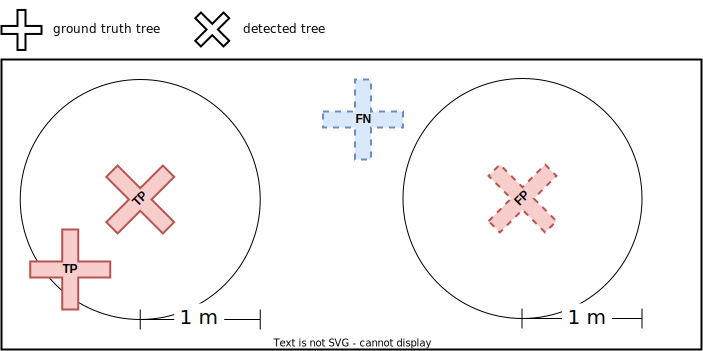
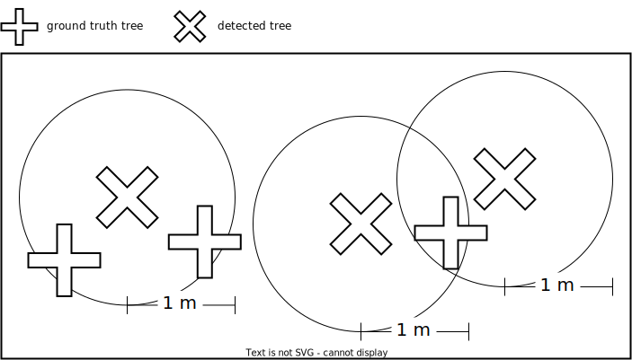

# Assessment scripts

## Rationale

The STDL used a couple of third-party tools, namely [TerraScan](https://terrasolid.com/products/terrascan/) and the [Digital Forestry Toolbox (DFT)](https://mparkan.github.io/Digital-Forestry-Toolbox/), in order to detect trees out of point clouds obtained by Airborne Laser Scanning (ALS, also commonly known by the acronym LiDAR - Light Detection And Ranging). Both tools are capable to output: 

1. a segmented point cloud, in which points associated to the same tree share either the same color; 
2. one (X, Y, Z) triplet per detected tree, where the X, Y, Z coordinates are
  * computed by averaging... [WHAT? HOW?]
  * expressed in the same reference system as the input point cloud.

As the ground truth data the STDL was provided with take the form of one (X', Y') pair per tree, with Z' implicitly equal to 1 meter above the ground, the comparison between detections and ground truth trees could only be performed on the common ground of points in 2D space. In other words, we could not assess the 3D point clouds segmentations obtained by either TerraScan or DFT against reference/ground truth segmentations.

The problem which needed to be solved amounts to finding matching and unmatching items between two sets of 2D points:

1. a 1st set including the (X', Y') coordinates of ground truth trees;
2. a 2nd set including the (X, Y) coordinates of detected trees.

In order to fulfill the requirement of a **1 meter accuracy** which was set by the beneficiaries of this project, the following matching rule was adopted:

> a detection (D) matches a ground truth tree (GT) (and vice versa) if and only if the Cartesian distance between D and GT is less or equal to 1 meter

The following image shows how such a rule allows one to tag

* detections as either True Positives (TPs) or False Positives (FPs)
* ground truth trees as either True Positives (TPs) or False Negatives (FNs)

in the most trivial case:

 
<i>Tagging as True Positive (TP), False Positive (FP), False Negative (FN) ground truth and detected trees in the most trivial case.</i>

Actually, far less trivial cases can arise, such as the one illustrated by the following image:

 
<i>Only one detection can exist for two candidate ground truth trees, or else two detections can exist for only one candidate ground truth tree.</i>

The STDL designed and implemented an algorithm, which would produce relevant TP, FP, FN tags and counts even in such more complex cases. For instance, in a setting like the one in the image here above, one would expect the algorithm to count 2 TPs, 1 FP, 1 FN.

Details are provided here below.

## The tagging and counting algorithm

### 1st step: geohash detections and ground truth trees

[...]

### 2nd step: convert point detections to circles

As a 2nd step, each detection is converted to a circle,

* centered on the (X, Y) coordinates of the detection;
* having a 1 m radius.

This operation can be accomplished by generating a 1 m buffer around each detection. For the sake of precision, [this method](https://shapely.readthedocs.io/en/latest/manual.html#object.buffer) was used, which generates a polygonal surface approximating the intended circle.

### 3rd step: perform left and right outer spatial joins

As a 3rd step, the following two spatial joins are computed:

1. left outer join between the circles generated at the previous step and ground truth trees; 

2. right outer join between the same two operands.

In both cases, the "intersects" operation is used (cf.&nbsp;[this page](https://geopandas.org/en/stable/gallery/spatial_joins.html) for more technical details).

### 4th step: tag trivial False Positives and False Negatives

All those detections output by the left outer join for which no right attribute exists (in particular, we focus on the right geohash) can trivially be tagged as FPs. As a matter of fact, this means that the 1 m circular buffer surrounding the detection does not intersect any ground truth tree; in other words, that no ground truth tree can be found within 1 m from the detection. The same reasoning leads to trivially tagging as FNs all those ground truth trees output by the right outer join for which no left attribute exists.

For reasons which will be clarified here below, the algorithm does not actually tag items as either FPs or FNs; instead, 

* TP and FP "charges" are assigned to detected trees;
* TP and FN charges are assigned to ground truth trees.

Here's how:

* for FP detected trees:

    | TP charge | FP charge |
    |-----------|-----------| 
    | 0         | 1         |

* for FN ground truth trees:

    | TP charge | FN charge |
    |-----------|-----------| 
    | 0         | 1         |

### 5th step: ...
